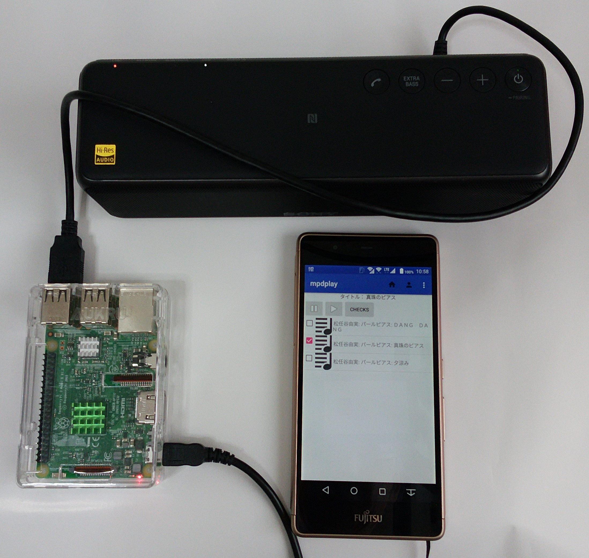
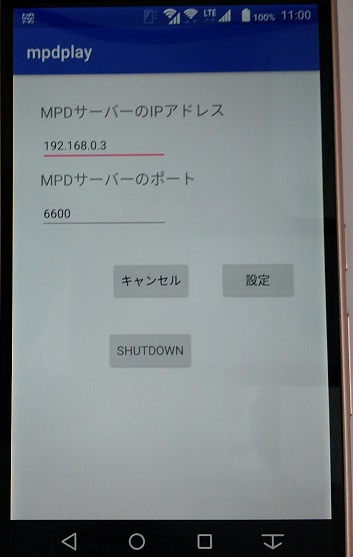

# mpdplay
MPD(Music Player Daemon)のスマホ用（Android）クライアントです。 
ラズベリーパイ３向けに作りました。 
Android Studio にインポートしてから、usb接続したスマホにインストールしてください。 
 
<a href="https://wiki.archlinux.jp/index.php/Music_Player_Daemon">MPD(Music Player Daemon)</a>

<h2>利用条件</h2> 

ミュージックファイルは、mp3形式で、アーティスト、アルバム、タイトルが設定されていることが前提です。 

<h2>利用方法</h2>
・MPDをラズベリーパイ３にインストールし、ミュージックファイルをmusicフォルダにコピーします。 
・メニューのサーバー設定から、ラズベリーパイで稼働しているMPDのIPアドレスとポート番号を設定します。 
・プログラムを再起動すると曲名のリストが表示されます。 
・曲名のリストは、メニューから選択すると、アーティストごと、アルバムごとに 
　表示することができます。 
・曲名をチェックして、プレイボタンを押します。 
・プレイ中の曲名を曲名リストの上に表示します。 
・メニューのサーバー設定に、ラズベリーパイをシャットダウンするボタンがありますが 
　有効にするためには、サーバー側に、ラズベリーパイを　poweroffするホームページを 
　呼び出す仕組みが別途必要です。 
<h2>利用状況</h2>
SONYのh.ear goにUSB接続しています。特別なドライバーは不要でした。アウトプットをUSB側に 
切り替えるだけでOKです。 
 
 
<h3>メニューのサーバー設定</h3>
サーバーをシャットダウンさせるボタンがあります。
 
